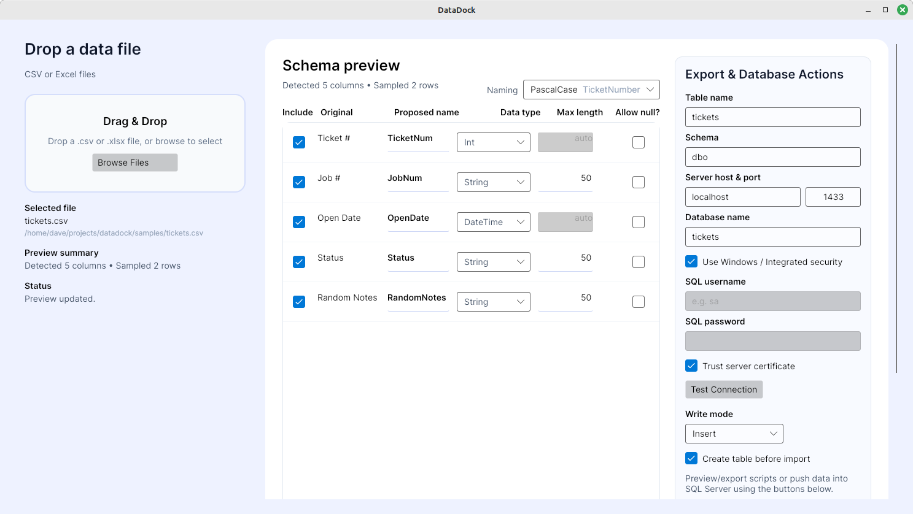

# DataDock

DataDock is a cross-platform **data import and schema generation tool** designed for engineers who routinely ingest CSV/XLSX files into SQL Server. It infers schemas, generates `CREATE TABLE` scripts, validates rows, and can push cleaned data directly into a database — all without the fragile ACE/OLEDB provider or the SSMS “Import Data” wizard.

DataDock ships as:

* **An Avalonia desktop GUI** (the primary user experience)
* **A command-line interface (CLI)** for automation, scripting, CI pipelines, and power users
* **A shared Core library (DataDock.Core)** providing schema inference, validation, conversion, mapping, and SQL dialect implementations



---

## ✨ Features

* **Workbook-first schema inference**

  * Detect column names, compute data types, and bucket string lengths into
    `50, 100, 255, 500, 1000, 2000, 3000, 4000`.

* **Schema generation (`schemagen`)**

  * Produce ready-to-run `CREATE TABLE` SQL for new tables.

* **Import pipeline**

  * Validate, convert, map fields, export JSON, and write to SQL Server tables.

* **Flexible write modes**

  * `insert`, `truncate-insert`, `upsert` (requires key fields).

* **DB-first or Profile-first**

  * Use DB schemas automatically for existing tables.
  * Or define/override behavior via lightweight JSON profiles.

* **Global config (`datadock.config.json`)**

  * Default DB connection, schema, column naming style, inference rules.

* **Cross-platform GUI**

  * Drag/drop workbooks, preview inferred schemas, fix issues inline, import with one click.

* **Zero dependency on ACE/OLEDB**

  * Works on Linux, macOS, and Windows with pure .NET 8.

---

## 📦 Installation

Clone and run from source:

```bash
git clone <repo-url>
cd DataDock
dotnet restore
```

Run GUI:

```bash
dotnet run --project DataDock.Gui
```

Run CLI:

```bash
dotnet run --project DataDock.Cli -- --help
```

---

## 📘 Documentation

Full documentation is available inside the `/docs` folder:

* **[CLI reference](docs/CLI.md)**
* **[Global configuration](docs/CONFIG.md)**
* **[Profiles & schema strategies](docs/PROFILES.md)**
* **[Common workflows](docs/WORKFLOWS.md)**
* **[Architecture overview](docs/ARCHITECTURE.md)**
* **[Roadmap](docs/ROADMAP.md)**

---

## 🧪 Development Setup

DataDock requires:

* .NET 8 SDK
* SQL Server instance (local or containerized)

Recommended dev setup using Docker:

```bash
docker run -e "ACCEPT_EULA=Y" \
  -e "SA_PASSWORD=YourStrong!Passw0rd" \
  -p 1433:1433 \
  --name mssql-dev \
  -d mcr.microsoft.com/mssql/server:2022-latest
```

More examples in [`docs/WORKFLOWS.md`](docs/WORKFLOWS.md).

---

## 🤝 Contributing

Pull requests and issues are welcome!
See `CONTRIBUTING.md` for guidelines, testing expectations, branching strategy, and coding conventions.

---

## 🪪 License

MIT License — free to use, modify, fork, and build upon.

---

## 💛 Support the Project

If DataDock saves you hours of frustration:

BTC: `bc1qv5jguu4kcfqfgde6aely2n2cs5zkkv4v6g5ma8`

GitHub Sponsors: *(coming soon)*

Buy Me a Coffee / Ko-fi: *(coming soon)*

